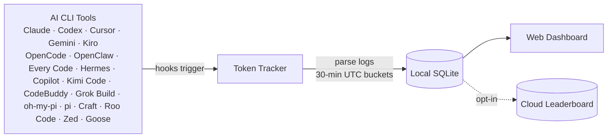

 <div align="center">

# Token Tracker

**English** · [简体中文](./README.zh-CN.md) · [日本語](./README.ja.md) · [한국어](./README.ko.md)

### Know exactly what you're spending on AI — across every CLI

Auto-collect token counts from **22 AI coding tools**, aggregate them locally, and see real cost trends in a beautiful dashboard. No cloud account, no API keys, no setup — just one command.

[](https://www.npmjs.com/package/@ipv9/tokentracker-cli)
[](https://www.npmjs.com/package/@ipv9/tokentracker-cli)
[](https://opensource.org/licenses/MIT)
[](https://www.npmjs.com/package/@ipv9/tokentracker-cli)
[](https://github.com/pitimon/TokenTracker/stargazers)

<br/>

<video src="https://github.com/user-attachments/assets/3275979d-bbed-4639-83e2-8b7d83bed6af" controls muted playsinline poster="https://raw.githubusercontent.com/pitimon/TokenTracker/main/docs/screenshots/dashboard-dark.png" width="820">
  
</video>

<br/><br/>

⭐ **If TokenTracker saves you time, please [star it on GitHub](https://github.com/pitimon/TokenTracker) — it helps other developers find it.**

</div>

---

## ⚡ Quick Start

> **Requirements**: Node.js **20+**. Cursor token reading uses the system `sqlite3` CLI when available and falls back to `node:sqlite` on supported Node releases.

```bash
npx --yes @ipv9/tokentracker-cli
```

That's it. First run installs hooks, syncs your data, and opens the dashboard at `http://localhost:7680`.

**What you get in 30 seconds:**
- 📊 A local dashboard at `localhost:7680` with usage trends, model breakdown, cost analysis, 24h/day/week/month views, and visible-only auto-refresh
- 🔌 Auto-detected hooks for every supported AI tool you have installed
- 🏠 100% local — no account, no API keys, no network calls (except optional leaderboard)
- 🧩 *Optional:* a Skills tab that browses 250+ public skills and syncs them across Claude · Codex · Grok · Antigravity · Gemini · OpenCode · Hermes

Install globally for shorter commands:

```bash
npm install -g @ipv9/tokentracker-cli

tokentracker              # Open the dashboard
tokentracker sync         # Manual sync
tokentracker status       # Check hook status
tokentracker status --json     # Machine-readable summary (pipe to jq, ingest from AI agents)
tokentracker status --light    # Plain ASCII table (CI / SSH, no spinner)
tokentracker doctor       # Health check
```

## ✨ Features

- 🔌 **22 AI tools out of the box** — Claude Code, Codex CLI, Cursor, Gemini CLI, Antigravity, Kiro, OpenCode, OpenClaw, Every Code, Hermes Agent, GitHub Copilot, Kimi Code, CodeBuddy, Grok Build, oh-my-pi, pi, Craft Agents, Kilo CLI, Kilo Code, Roo Code, Zed Agent, Goose
- 🏠 **100% local** — Token data never leaves your machine. No account, no API keys.
- 🚀 **Zero config** — Hooks auto-install on first run. From zero to dashboard in 30 seconds.
- 📊 **Beautiful dashboard** — Usage trends, cost breakdowns by model, GitHub-style activity heatmap, project attribution, 24h detail view, browser-timezone "Updated" timestamp, and configurable visible-only auto-refresh (`Off`, `30s`, `60s`, `120s`; default `30s`)
- 📈 **Real-time rate limit tracking** — Claude / Codex / Cursor / Gemini / Kiro / Copilot / Antigravity quota windows with reset countdowns
- 💰 **Cost engine** — 2,200+ models priced via [LiteLLM](https://github.com/BerriAI/litellm/blob/main/model_prices_and_context_window.json) (auto-refreshed daily) + curated overrides for niche tools (Kiro, Cursor Composer, Kimi, CodeBuddy hy3); 24h disk cache + bundled offline snapshot mean accurate USD without an internet connection. Models without published vendor pricing (e.g. Tencent hy3-preview) are tracked by tokens but show $0 cost until the vendor publishes a rate.
- 🌐 **Optional leaderboard** — Compare with developers worldwide; drag-to-reorder columns to focus on the providers you care about (opt-in, sign in to participate)
- 🧩 **Optional Skills tab** — browse 250+ public skills from `anthropics/skills`, `ComposioHQ/awesome-claude-skills`, `skills.sh` and any GitHub repo you add; sync them across Claude / Codex / Grok / Antigravity / Gemini / OpenCode / Hermes with named targets and one-click Undo
- 🔒 **Privacy-first** — Only token counts and timestamps. Never prompts, responses, or file contents.

---

## 🖼️ Showcase

<table>
<tr>
<td width="50%">

**Dashboard** — usage trends, model breakdown, cost analysis


</td>
<td width="50%">

**Global Leaderboard** — compare with developers worldwide


</td>
</tr>
<tr>
<td colspan="2">

**Skills Manager** — browse 250+ public skills from GitHub & `skills.sh`, install once, sync to Claude / Codex / Grok / Antigravity / Gemini / OpenCode / Hermes. Per-target toggles, one-click Undo, no manual file copying.


</td>
</tr>
</table>

---

## 🔌 Supported AI Tools

| Tool | Detection | Method |
|---|---|---|
| **Claude Code** | ✅ Auto | SessionEnd hook in `settings.json` |
| **Codex CLI** | ✅ Auto | TOML notify hook in `config.toml` |
| **Cursor** | ✅ Auto | API + SQLite auth token |
| **Kiro** | ✅ Auto | SQLite + JSONL hybrid |
| **Gemini CLI** | ✅ Auto | SessionEnd hook |
| **OpenCode** | ✅ Auto | Plugin system + SQLite |
| **OpenClaw** | ✅ Auto | Session plugin |
| **Every Code** | ✅ Auto | TOML notify hook |
| **Hermes Agent** | ✅ Auto | SQLite sessions table (`~/.hermes/state.db`) |
| **GitHub Copilot** | ✅ Auto | OpenTelemetry file exporter (`COPILOT_OTEL_FILE_EXPORTER_PATH`) |
| **Kimi Code** | ✅ Auto | Passive `wire.jsonl` reader (`~/.kimi/sessions/**/wire.jsonl`) |
| **oh-my-pi (Pi Coding Agent)** | ✅ Auto | Passive reader (`~/.omp/agent/sessions/**/*.jsonl`) |
| **CodeBuddy** (Tencent) | ✅ Auto | SessionEnd hook in `~/.codebuddy/settings.json` (Claude-Code fork) |
| **Grok Build** (xAI) | ✅ Auto | SessionEnd hook + passive `updates.jsonl` / `signals.json` scan (`~/.grok/sessions/**/`) |
| **Kilo CLI** (kilo.ai) | ✅ Auto | Passive SQLite reader (`~/.local/share/kilo/kilo.db`, OpenCode-fork schema) |
| **Kilo Code** (VS Code extension) | ✅ Auto | Passive `ui_messages.json` reader (Cursor/Code/CodeBuddy/Windsurf globalStorage) |
| **Antigravity** | ✅ Auto | Passive transcript reader (`~/.gemini/{antigravity,antigravity-ide,antigravity-cli}/brain/**/transcript.jsonl`) |
| **pi** (`@mariozechner/pi-coding-agent`) | ✅ Auto | Passive reader (`~/.pi/agent/sessions/**/*.jsonl`) |
| **Craft Agents** | ✅ Auto | Passive session reader (`~/.craft-agent` + workspace session logs) |
| **Roo Code** (VS Code extension) | ✅ Auto | Passive `ui_messages.json` reader (`rooveterinaryinc.roo-cline`) |
| **Zed Agent** | ✅ Auto | Passive SQLite reader (`threads.db`, hosted `zed.dev` models only) |
| **Goose** (Block) | ✅ Auto | Passive SQLite reader (`sessions.db`, cumulative deltas) |

> **Do I need to install any plugin or hook manually?** No. `tokentracker` (or `tokentracker init`) handles everything on first run:
> - **Hook-based** tools (Claude Code, Codex, Gemini, Every Code, **CodeBuddy**, **Grok Build**) — we write a SessionEnd hook or TOML notify entry into the tool's own config.
> - **Plugin-based** tools (OpenCode, **OpenClaw**) — the plugin ships inside the npm package (`~/.tokentracker/app/openclaw-plugin/`). We link it via the tool's own CLI (`openclaw plugins install --link …` + `enable`). No download, no drag-and-drop.
> - **Passive readers** (Cursor, Kiro, Hermes, Kimi Code, Copilot, **Grok Build**, **oh-my-pi**, **pi**, **Craft Agents**, **Kilo CLI**, **Kilo Code**, **Roo Code**, **Antigravity**, **Zed Agent**, **Goose**) — nothing is installed into those tools. We only read files they already produce (SQLite DB, JSONL, OTEL export, session logs).
> - **Grok Build estimate** — current local telemetry exposes cumulative `updates.jsonl` `totalTokens`, but not a stable prompt/output/cache split; `signals.json` remains a fallback with `contextTokensUsed` snapshots. TokenTracker estimates Grok cost until per-call usage details are available.
>
> Run `tokentracker status` anytime to verify every integration's state. If something shows `skipped`, the `detail` column explains why (e.g. tool CLI not on `PATH`, config unreadable).
>
> Deeper dives: [OpenClaw integration & troubleshooting](docs/openclaw-integration.md).

Missing your tool? [Open an issue](https://github.com/pitimon/TokenTracker/issues/new) — adding new providers is usually one parser file away.

---

## 🆚 Why TokenTracker? <a id="ccusage-alternative"></a>

> **Looking for a ccusage alternative with a GUI?** TokenTracker covers 22 tools (not just Claude Code), adds a local dashboard, and de-duplicates token records correctly across providers — so your numbers match the providers' own billing.

|                          | **TokenTracker** | ccusage     | Cursor stats |
|--------------------------|:---:|:---:|:---:|
| **AI tools supported**   | **22**           | 1 (Claude)  | 1 (Cursor)   |
| **Local-first, no account** | ✅            | ✅           | ❌            |
| **Rate-limit tracking**  | ✅ 7 providers    | ❌           | Cursor only  |
| **Accurate multi-provider dedup** | ✅      | ❌ ¹         | —            |

<sub>¹ `reqId`-based deduplication over-counts providers that omit a request ID (DeepSeek / Kimi / MiniMax / Claude sub-agents) by 1.6–3.7×. TokenTracker dedups on a composite key, so totals match each provider's own billing dashboard.</sub>

---

## 🏗️ How It Works



1. AI CLI tools generate logs during normal use
2. Lightweight hooks detect changes and trigger sync (Cursor uses API instead of hooks)
3. Token counts parsed locally — never any prompt or response content
4. Aggregated into 30-minute UTC buckets
5. Dashboard reads from the local snapshot, displays timestamps in your browser timezone, and auto-refreshes visible tabs every 30 seconds by default
6. In local mode, dashboard auto-refresh also starts a background local sync and refreshes again only when new 30-minute buckets were queued

---

## 🛡️ Privacy

| Protection | Description |
|---|---|
| **No content upload** | Only token counts and timestamps. Never prompts, responses, or file contents. |
| **Local-only by default** | All data stays on your machine. The leaderboard is fully opt-in. |
| **Auditable** | Open source. Read [`src/lib/rollout.js`](src/lib/rollout.js) — only numbers and timestamps. |
| **No telemetry** | No analytics, no crash reporting, no phone-home. |

---

## 📦 Configuration

Most users never need this — defaults are sensible. For advanced setups:

| Variable | Description | Default |
|---|---|---|
| `TOKENTRACKER_DEBUG` | Enable debug output (`1` to enable) | — |
| `TOKENTRACKER_HTTP_TIMEOUT_MS` | HTTP timeout in milliseconds | `20000` |
| `CODEX_HOME` | Override Codex CLI directory | `~/.codex` |
| `GEMINI_HOME` | Override Gemini CLI directory | `~/.gemini` |
| `TOKENTRACKER_GROK_HOME` | Override Grok Build directory for the Grok integration and Skills Manager | `~/.grok` |
| `GROK_HOME` | Legacy Grok Build directory override, used when `TOKENTRACKER_GROK_HOME` is unset | `~/.grok` |
| `TOKENTRACKER_ANTIGRAVITY_HOME` | Force a single Antigravity Skills directory (auto-detects `~/.gemini/antigravity` + `~/.gemini/antigravity-ide` otherwise) | auto |

### Dashboard refresh behavior

The local dashboard is designed to stay current without hammering the local sync path:

- Auto-refresh runs only while the dashboard tab is visible.
- The default interval is `30s`; the selector supports `Off`, `30s`, `60s`, and `120s`.
- If an older browser session has a removed `10s` preference saved, TokenTracker falls back to `30s`.
- Manual refresh runs local sync first in local mode, then reloads dashboard data.
- Auto-refresh starts local sync in the background, keeps the UI responsive, and only performs a second data reload when sync reports new 30-minute buckets.
- The Total tokens panel shows an `Updated ...` timestamp formatted in the browser's timezone, so you can tell when the displayed snapshot last refreshed.

---

## 🛠️ Development

```bash
git clone https://github.com/pitimon/TokenTracker.git
cd TokenTracker
npm install

# Build dashboard + run CLI
cd dashboard && npm install && npm run build && cd ..
node bin/tracker.js

# Tests
npm test
```

## 🔧 Troubleshooting

### CLI

<details>
<summary><b>"engines.node" or unsupported version error</b></summary>

<br/>

TokenTracker requires **Node 20+**. Check your version:

```bash
node --version
```

If lower, upgrade via [nvm](https://github.com/nvm-sh/nvm), [fnm](https://github.com/Schniz/fnm), or your package manager (`brew upgrade node`, `apt install nodejs`).

</details>

<details>
<summary><b>Port 7680 already in use</b></summary>

<br/>

The dashboard server picks the next free port automatically (`7681`, `7682`, ...) when `7680` is taken. The actual port is logged on startup. If you want to force a specific port:

```bash
PORT=7700 tokentracker serve
```

To find what's holding `7680`:

```bash
lsof -i :7680
```

</details>

<details>
<summary><b>macOS local-sync LaunchAgent exits with a stale checkout path</b></summary>

<br/>

If `~/Library/LaunchAgents/com.pitimon.tokentracker.local-sync.plist` was installed by an older development checkout, its wrapper may still point at a deleted repo path. The symptom in `~/.tokentracker/tracker/logs/local-sync.err.log` looks like:

```text
cd: /Users/you/src/TokenTracker: No such file or directory
```

Regenerate the local services from the current checkout:

```bash
bash scripts/install-local-service.sh
```

Then verify:

```bash
launchctl print gui/$(id -u)/com.pitimon.tokentracker.local-sync
tail -n 50 ~/.tokentracker/tracker/logs/local-sync.err.log
```

The current service wrapper uses `npx --yes @ipv9/tokentracker-cli sync --auto` instead of a hardcoded repo path, and skips automatic cloud-capable sync when a device token is configured.

</details>

<details>
<summary><b>A provider isn't being detected</b></summary>

<br/>

Check the integration status:

```bash
tokentracker status
```

Then run the doctor for a deeper health check:

```bash
tokentracker doctor
```

If a provider shows as not configured even though you use it, try `tokentracker activate-if-needed` to re-run hook detection. If still missing, [open an issue](https://github.com/pitimon/TokenTracker/issues/new) with the `doctor` output attached.

</details>

<details>
<summary><b>How to uninstall hooks and remove all config</b></summary>

<br/>

```bash
tokentracker uninstall
```

This removes every hook TokenTracker installed across all detected AI tools, plus the local config and data. Safe to re-run.

</details>

## 🪪 README Badges

Show off your token usage on your GitHub profile or project README.

To get `YOUR_USER_ID`:
1. Run `tokentracker`, open the dashboard, and sign in to the leaderboard.
2. Go to **Settings → Account**.
3. Use the **User ID** shown there. On headless machines, `tokentracker device-login` also writes the same `user_id` to `~/.tokentracker/tracker/config.json`.

Then drop one of these in:

```markdown
[](https://github.com/pitimon/TokenTracker)
[](https://github.com/pitimon/TokenTracker)
[](https://github.com/pitimon/TokenTracker)
```

> The link target defaults to the TokenTracker repo so every click helps other developers discover the tool. Swap it for your leaderboard profile or personal site if you'd rather route clicks elsewhere.

Renders shields.io-compatible badges with your current totals (60s cache):

| Param | Values | Default |
|---|---|---|
| `metric` | `tokens` / `cost` / `rank` | `tokens` |
| `period` | `week` / `month` / `total` | `total` |
| `style` | `flat` / `flat-square` | `flat` |
| `label` | any short string | metric name |
| `color` | hex, e.g. `ff6b35` | brand green |

> **Privacy**: badges only resolve for profiles where leaderboard sharing is **on** (`Settings → Account → Public profile`). Private profiles get a "private" placeholder.

---

## ⭐ Star History

<a href="https://star-history.com/#pitimon/TokenTracker&Date">
  
</a>

---

## 🤝 Contributing & Support

- **Bugs / feature requests**: [open an issue](https://github.com/pitimon/TokenTracker/issues/new)
- **Security**: see [SECURITY.md](SECURITY.md) — please don't open public issues for security reports
- **Pull requests**: see [CONTRIBUTING.md](CONTRIBUTING.md) for setup, tests, and how to add a new AI tool integration
- **Questions / showcase**: [GitHub Discussions](https://github.com/pitimon/TokenTracker/discussions)

## 🙏 Credits

The Clawd character design belongs to Anthropic. This is a community project with no official affiliation with Anthropic.

## License

[MIT](LICENSE)

---

<div align="center">

**Token Tracker** — Quantify your AI output.

<a href="https://www.npmjs.com/package/@ipv9/tokentracker-cli">npm</a>  ·  <a href="https://github.com/pitimon/TokenTracker">GitHub</a>

</div>
